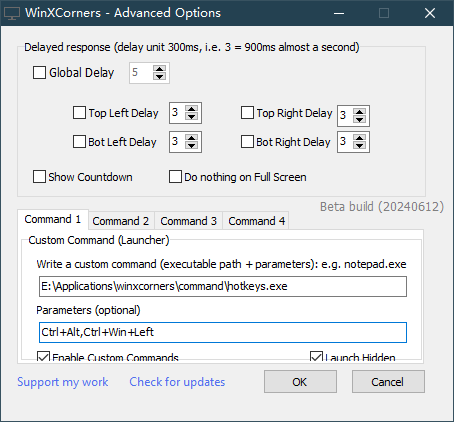

# Keyboard Simulator

Simulate keyboard keystrokes and support multiple sets of combined keys.

## 💡 Usage

Basic usage:

```bash
simulator.exe Ctrl+Alt,Ctrl+Win+Left
```

Used in winxcorners:

Since winxcorners does not support custom keys, this operation can be achieved through this program. Fisrt you can compile this cpp file or download from releases page and put the exe file in the specified directory, write the full path of the exe in the `Custom Command` of winxcorners, and fill in the keys to be simulated in `Parameters`.



## 🗺️ Keymap

This table organizes the keys into categories to make it easier to identify their purpose and usage in the code.

| **Category**         | **Key Name**                                                                                                       | **Description**                                 |
| -------------------------- | ------------------------------------------------------------------------------------------------------------------------ | ----------------------------------------------------- |
| **Modifier Keys**    | `Ctrl`, `LCtrl`, `RCtrl`                                                                                           | Control keys (general, left, right)                   |
|                            | `Shift`, `LShift`, `RShift`                                                                                        | Shift keys (general, left, right)                     |
|                            | `Alt`, `LAlt`, `RAlt`                                                                                              | Alt keys (general, left, right)                       |
|                            | `Win`, `RWin`                                                                                                        | Windows keys (left, right)                            |
| **Arrow Keys**       | `Left`, `Right`, `Up`, `Down`                                                                                    | Directional arrow keys                                |
| **Alphabet Keys**    | `A` - `Z`                                                                                                            | Letters A through Z                                   |
| **Number Keys**      | `0` - `9`                                                                                                            | Number keys on the main keyboard                      |
| **Function Keys**    | `F1` - `F12`                                                                                                         | Function keys                                         |
| **Numpad Keys**      | `Num0` - `Num9`                                                                                                      | Number keys on the numpad                             |
|                            | `NumLk`, `Div`, `Mul`, `Sub`, `Add`, `Dec`                                                                   | Numpad Lock, Divide, Multiply, Subtract, Add, Decimal |
| **Control Keys**     | `Esc`, `Tab`, `Caps`, `Space`, `Enter`, `Bksp`                                                               | Escape, Tab, Caps Lock, Space, Enter, Backspace       |
| **Editing Keys**     | `Ins`, `Del`, `Home`, `End`, `PgUp`, `PgDn`                                                                  | Insert, Delete, Home, End, Page Up, Page Down         |
| **Punctuation Keys** | `SColon`, `Plus`, `Comma`, `Minus`, `Dot`, `Slash`, `Tilde`, `LBrack`, `Bslash`, `RBrack`, `Quote` | Various punctuation marks like ; + , - . / ~ [ \ ] '  |
| **Special Keys**     | `PrtSc`, `Scroll`, `Pause`, `Menu`                                                                               | Print Screen, Scroll Lock, Pause, Application Menu    |
